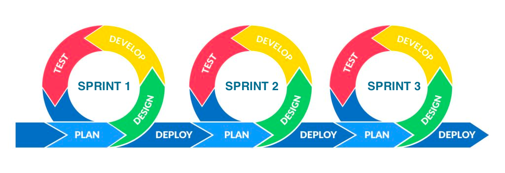
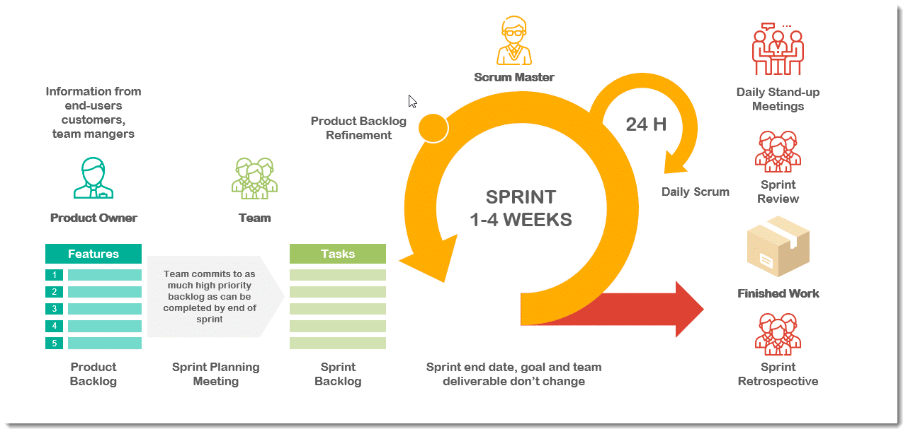

# Hesap Technical Documentation and Guideline

## Preface


Current documentation is intended to convey basic information about the underlying product, its infrastructure and
coding guidelines.

## Technical Documentation

## Way of working
Scrum methodology will be used for the product development. Scrum is an agile development methodology used in the development of Software based on an iterative and incremental processes. Scrum is adaptable, fast, flexible and effective agile framework that is designed to deliver value to the customer throughout the development of the project. The development starts from a general idea of what needs to be built, elaborating a list of characteristics ordered by priority (product backlog) that the owner of the product wants to obtain.

Here is how Scrum Development Process looks like:



### Scrum Master
The scrum master is the facilitator of the scrum development process. In addition to holding daily meetings with the scrum team, the scrum master makes certain that scrum rules are being enforced and applied as intended. The scrum master’s responsibilities also include coaching and motivating the team, removing impediments to sprints, and ensuring that the team has the best possible conditions to meet its goals and produce deliverable products.

### Product Owner
The product owner represents stakeholders, who are typically customers. To ensure the scrum team is always delivering value to stakeholders and the business, the product owner determines product expectations, records changes to the product and administers a scrum backlog, a detailed and constantly updated to-do list for the scrum project. The product owner is also responsible for prioritizing goals for each sprint, based on their value to stakeholders, such that the most important and deliverable features are built in each iteration. Another responsibility of the product owner is to represent the voice of the customer (and other external stakeholders), ensuring that all development work reflects the needs of the end-user.

### Product Backlog
Product Backlog is the primary list of work that needs to get done maintained by the product owner or product manager. This is a dynamic list of features, requirements, enhancements, and fixes that acts as the input for the sprint backlog. It is, essentially, the team’s “To Do” list. The product backlog is constantly revisited, re-prioritized and maintained by the Product Owner because, as the time passes or the market changes, items may no longer be relevant or problems may get solved in other ways.

### Sprint
A sprint is the actual time period when the scrum team works together to finish an increment. During this period, the scope can be re-negotiated between the product owner and the development team if necessary. This forms the crux of the empirical nature of scrum.

All the events — from planning to retrospective — happen during the sprint. Once a certain time interval for a sprint is established, it has to remain consistent throughout the development period. This helps the team learn from past experiences and apply that insight to future sprints.

Here is an in-depth view of how Scrum components interact with each-other:



### Sprint Planning
The work to be performed (scope) during the current sprint is planned during this meeting by the entire development team. This meeting is led by the scrum master and is where the team decides on the sprint goal. Specific user stories are then added to the sprint from the product backlog. These stories always align with the goal and are also agreed upon by the scrum team to be feasible to implement during the sprint.

At the end of the planning meeting, every scrum member needs to be clear on what can be delivered in the sprint and how the increment can be delivered. In current project a Sprint planning lasts for three weeks and Sprint planning meeting should be held every 3rd Tuesday.

### Sprint Backlog
Sprint Backlog is the list of items, user stories, or bug fixes, selected by the development team for implementation in the current sprint cycle. Before each sprint, in the sprint planning meeting the team chooses which items it will work on for the sprint from the product backlog. A sprint backlog may be flexible and can evolve during a sprint. However, the fundamental sprint goal – what the team wants to achieve from the current sprint – cannot be compromised.

At the end of a Sprint Planning, the tickets decided to be developed during the Sprint should be moved from a Product Backlog to a Sprint Backlog. Once the Sprint Backlog is fully defined with corresponding tickets, no new ticket must be added or no existing ticket must be deleted from the Sprint Backlog. There are might be some exceptions to the above rule, that should be discussed and confirmed by the Product Lead and the Product Owner.

### Increment
The Increment is the sum of all the tasks, use cases, user stories, product backlogs and any element that was developed during the sprint and that will be made available to the end user in the form of Software.

### Grooming
The main objective behind the grooming is to provide more technical as well as business descriptions to the ticket so that it is clear for the developer what to do and how to do it. This process involves a Product Owner or Product Manager, Technical Lead and a developer who is going to develop according to the given ticket.

### Daily Scrum a.k.a. Daily Stand-up
This is a daily super-short meeting that happens at the same time (usually mornings) and place to keep it simple. This meeting is also called a ‘daily stand-up’ emphasizing that it needs to be a quick one. The goal of the daily scrum is for everyone on the team to be on the same page, aligned with the sprint goal, and to get a plan out for the next 24 hours.

The stand up is the time to voice any concerns you have with meeting the sprint goal or any blockers.

A common way to conduct a stand up is for every team member to answers three questions in the context of achieving the sprint goal:

* What did I do yesterday?
* What do I plan to do today?
* Are there any obstacles?

However, we’ve seen the meeting quickly turn into people reading from their calendars from yesterday and for the next day. The theory behind the stand up is that it keep distracting chatter to a daily meeting, so the team can focus on the work for the rest of the day. So if it turns into a daily calendar read-out, don’t be afraid to change it up and get creative.

The duration of the daily stand-ups should be no more than 15 minutes and it should start at 21:00 every day.

### Sprint Preview a.k.a Sprint Demo
The goal of the sprint review is to show what work has been completed with regards to the product backlog for future deliveries. The finished sprint is reviewed, and there should already be a clear and tangible advancement in the product to present to the client.

Each sprint ends with a Sprint Demo, specifically each 3rd Saturday we'll have a Sprint Demo and the Scrum master will present the demo. It is a good practice to have fun at the end of each Sprint Demo, e.g. to play some sort of fun game when the demo ends. Often such activities boost team's morale.

Please note that, all current sprint tickets should be closed before the Sprint Demo. The tickets which weren't closed for the valid reasons should be moved to the upcoming Sprint Backlog.

### Sprint Retrospective
The team reviews the completed goals of the finished sprint, write down the good and the bad, so as not to repeat the mistakes again. This stage serves to implement improvements from the point of view of the development process. The goal of the sprint retrospective is to identify possible process improvements and generate a plan to implement them in the next Sprint. In other words, the idea behinds the Sprint Retro is to create a place where the team can focus on what went well and what needs to be improved for the next time, and less about what went wrong.

## Development Process

### Git Branching Model

Current project follows the <b>Trunk-Based Development</b> branching model.

Trunk-based development (TBD) is a branching model for software development where developers merge every new feature, bug fix, or other code changes to one central branch in the version control system. This branch is called <b>trunk</b>, <b>mainline</b>, or in Git, the <b>master</b> branch.

Trunk-based development enables continuous integration (CI) – and, by extension, continuous delivery (CD) – by creating an environment where commits to trunk naturally occur multiple times daily for each programmer. This makes it easy to satisfy the “everyone on the development team commits to trunk at least every 24 hours” requirement of continuous integration, and lays the foundation for the codebase to be releasable at any time, as is necessary for continuous delivery and continuous deployment (CI/CD).

## Infrastructure Setup

In order to run the project, following tools need to be installed on the machine beforehand:

1. <b>Oracle Java</b>. As of writing this document the latest version is: <b>Java 18</b>
2. <b>Gradle</b>. As of writing this document the version is: <b>Gradle 7.5.1</b>
3. <b>Docker Desktop</b>. As of writing this document the version is: <b>Docker Desktop 4.12.0</b>
4. <b>docker-compose</b>. Docker Desktop should have <b>docker-compose</b> installed in its package.

### Gradle's Compatibility with Java 16, 17, 18
If you face the following error when you try to configure the project using gradle:
```
Unrecognized option: --illegal-access=permit
Error: Could not create the Java Virtual Machine.
Error: A fatal exception has occurred. Program will exit.
```

Then you need to add following lines in <b><i>~/.gradle/gradle.properties</i></b> file. Please note that if you don't have such folder and/or file, then create it first and paste the following commands:
```
org.gradle.jvmargs=--illegal-access=permit
org.gradle.jvmargs=--add-exports jdk.compiler/com.sun.tools.javac.api=ALL-UNNAMED \
  --add-exports jdk.compiler/com.sun.tools.javac.file=ALL-UNNAMED \
  --add-exports jdk.compiler/com.sun.tools.javac.parser=ALL-UNNAMED \
  --add-exports jdk.compiler/com.sun.tools.javac.tree=ALL-UNNAMED \
  --add-exports jdk.compiler/com.sun.tools.javac.util=ALL-UNNAMED
```
### Docker-compose operations

#### Create all containers and start all of them

    docker-compose up -d

#### Create all containers with manual build

    docker-compose up -d --build

#### Shutdown all containers

    docker-compose down

#### Shutdown all including orphan containers

    docker-compose down --remove-orphans

#### List all running containers

    docker-compose ps

#### Start specific container(s)

```
docker-compose start product
docker-compose start product store auction api-gateway
```

#### Stop specific container(s)

```
docker-compose stop product
docker-compose stop product store auction api-gateway
```

#### List logs of all running containers

    docker-compose logs

#### Continuously list upcoming logs of all running containers

    docker-compose logs -f

#### Continuously list upcoming logs of specific container(s)

    docker-compose logs -f product auction

#### Start showing logs from last 200 lines of specific container(s)

    docker-compose logs -f --tail=200 product auction

#### Run a custom docker-compose file

    docker-compose -f docker-compose-dev.yml up -d

#### Remove specific container

    docker rm <container_id>

#### Kill specific container

    docker kill <container_id>

#### List all docker images

    docker images

#### Remove specific image

    docker rmi <image_id>

#### Remove all stopped containers, unused networks, dangling images and dangling build cache

    docker system prune

## Coding Guidelines

### Java Naming Conventions

Java naming conventions are sort of guidelines that application programmers are expected to follow to produce consistent
and readable code throughout the application. If teams do not follow these conventions, they may collectively write an
application code that is hard to read and difficult to understand.

Java heavily uses Camel Case notations for naming the methods, variables etc. and TitleCase notations for classes and
interfaces.

1. <b>Naming Packages</b>
   <br>
   Package names must be a group of words starting with all lowercase domain names (e.g. com, org, net, etc). Subsequent
   parts of the package name may be different according to an organization’s own internal naming conventions:
   ```java
    package com.example.webapp.controller; 

    package com.company.myapplication.web.controller;

    package com.google.search.common;
   ```

2. <b>Naming Classes</b>
   <br>
   In Java, class names generally should be nouns, in title-case with the first letter of each separate word
   capitalized. e.g.
   ```java
    public class User {}

    public class Employee {}

    public class RecordService {}

    public class AdvancedProductRepositoryImpl {}
   ```

3. <b>Naming Interfaces</b>
   <br>
   In Java, interfaces names, generally, should be adjectives. Interfaces should be in the title case with the first
   letter of each separate word capitalized. In some cases, interfaces can be nouns as well when they present a family
   of classes e.g. List and Map:
   ```java
    public interface Serializable {}

    public interface Cloneable {}

    public interface Iterable {}

    public interface LazyList {}

    public interface ConcurrentHashMap {}
   ```

4. <b>Naming Methods</b>
   <br>
   Methods always should be verbs. They represent action and the method name should clearly state the action they
   perform. The method name can be single or 2-3 words as needed to clearly represent the action. Words should be in
   camel case notation:
      ```java
       public Long getId() {}

       public void remove(final Object o) {}

       public Object update(final Object o) {}

       public Report findReportById(final Long id) {}

       public Report findProductByName(final String name) {}
      ```

   Also note that methods in a class should be sorted by visibility and alphabetically by names, e.g.
    1. All <b>public</b> methods should be sorted alphabetically by method names
    2. All <b>protected</b> methods should be sorted alphabetically by method names
    3. All <b>package private</b> methods should be sorted alphabetically by method names
    4. All <b>private</b> methods should be sorted alphabetically by method names
       <br><br>

5. <b>Naming Variables</b>
   <br>
   All instance, static and method parameter variable names should be in camel case notation. They should be short and
   enough to describe their purpose. Temporary variables can be a single character e.g. the counter in the loops.
   Methods in a class should be sorted by visibility and alphabetically by names, e.g.
    1. All <b>public</b> methods should be sorted alphabetically by method names
    2. All <b>protected</b> methods should be sorted alphabetically by method names
    3. All <b>package private</b> methods should be sorted alphabetically by method names
    4. All <b>private</b> methods should be sorted alphabetically by method names
   ```java
    public Long id;

    public EmployeeDao employeeDao;
    
    private Properties properties;
    
    for (int i = 0; i < list.size(); i++) {
    
    }
   ```

   Also note that class variables should be sorted by visibility and alphabetically by names, e.g.
    1. All <b>public</b> variables should be sorted alphabetically by variable names
    2. All <b>protected</b> variables should be sorted alphabetically by variable names
    3. All <b>package private</b> variables should be sorted alphabetically by variable names
    4. All <b>private</b> variables should be sorted alphabetically by variable names
       <br><br>

6. <b>Naming Constants</b>
   <br>
   Java constants should be all <b>UPPERCASE</b> where words are separated by <b>underscore</b> character (“_”). Make
   sure to use the final modifier with constant variables.
   ```java
    public final String SECURITY_TOKEN = "...";

    public final int INITIAL_SIZE = 16;

    public final Integer MAX_SIZE = Integer.MAX;
   ```

7. <b>Naming Generic Types</b>
   <br>
   Generic type parameter names should be uppercase single letters. The letter <b>'T'</b> for type is typically
   recommended. In JDK classes, <b>E</b> is used for collection elements, S is used for service loaders, and <b>K</b>
   and <b>V</b> are used for map keys and values.
   ```java
    public interface Map <K,V> {}

    public interface List<E> extends Collection<E> {}

    Iterator<E> iterator() {}
   ```

8. <b>Naming Enums</b>
   <br>
   Similar to class constants, enumeration names should be all uppercase letters.
   ```java
    enum Direction {NORTH, EAST, SOUTH, WEST}
   ```

9. <b>Naming Annotations</b>
   <br>
   Annotation names follow title case notation. They can be adjectives, verbs, or nouns based on the requirements.
   ```java
    public @interface FunctionalInterface {}

    public @interface Deprecated {}
    
    public @interface Documented {}
    
    public @Async Documented {}
    
    public @Test Documented {}
   ```

### REST API Naming Conventions

There are 11 basic principles which should be followed for naming REST APIs:

1. <b>Use nouns for naming URIs</b>
   ```
   https://api.example.com/v1/users
   https://api.example.com/v1/users/{id}
   https://api.example.com/v1/products/discount
   ```
   All REST APIs have a URL at which they can be accessed, e.g. https://api.example.com. Subdirectories of this URL
   denote different API resources, which are accessed using an Uniform Resource Identifier (URI). For example, the
   URI https://api.example.com/v1/users will return a list containing the users of a particular service.
   <br><br>

2. <b>Do not use verbs for naming URIs</b>
   ```
   https://api.example.com/v1/users
   https://api.example.com/v1/reviews/{id}
   https://api.example.com/v1/offers/cancelled
   ```
   In general, URIs should be named with nouns that specify the contents of the resource, rather than adding a verb for
   the function that is being performed. For example, you should use https://api.example.com/v1/users instead
   of https://api.example.com/v1/getUsers. This is because CRUD (Create, Read, Update, Delete) functionality should
   already be specified in the HTTP request (e.g. HTTP GET https://api.example.com/v1/users).
   <br><br>

3. <b>Prefer pluralized resources</b>
   ```
   https://api.example.com/v1/products
   https://api.example.com/v1/orders
   https://api.example.com/v1/users/admin
   ```
   Using nouns for naming URIs is a REST API naming best practice, but when should you use singular or plural nouns? In
   general, using plural nouns is preferred unless the resource is clearly a singular concept (
   e.g. https://api.example.com/v1/users/admin for the administrative user).
   <br><br>

4. <b>Use intuitive (no jargon), clear, unabridged names</b>
   ```
   https://api.example.com/v1/users/{id}/first-name
   https://api.example.com/v1/companies/{id}/address
   https://api.example.com/v1/orders/approved
   ```
   When naming REST API endpoints, you should use URI names that are intuitive and clear—ideally, something that third
   parties could guess even if they’ve never used your API before. In particular, avoid abbreviations and shorthand (
   e.g. https://api.example.com/users/123/fn instead of https://api.example.com/users/123/first-name)—unless that
   abbreviation is the preferred or most popular term, in which case feel free to use it (
   e.g. https://api.example.com/users/ids instead of https://api.example.com/users/identification-numbers).
   <br><br>

5. <b>Use forward slashes to denote URI hierarchy</b>
   ```
   https://api.example.com/v1/users/{id}/username
   https://api.example.com/v1/companies/{id}
   https://api.example.com/v1/products/sold
   ```
   REST APIs are typically structured in a hierarchy: for example, https://api.example.com/users/123/first-name will
   retrieve the first name of the user with ID number 123. The forward slash (“/”) character should be used to navigate
   this hierarchy, moving from general to specific when going from left to right in the URI.
   <br><br>

6. <b>Do not use trailing forward slash</b>
   ```
   https://api.example.com/v1/users
   https://api.example.com/v1/orders/{id}
   https://api.example.com/v1/products
   ```
   While forward slashes are good for denoting the hierarchy of your API, they’re not necessary at the very end of the
   URL, where they add complexity without adding clarity. For example, you should use https://api.example.com/users
   instead of https://api.example.com/users/.
   <br><br>

7. <b>Separate words with hyphens instead of underscores</b>
   ```
   https://api.example.com/v1/users/{id}/first-name
   https://api.example.com/v1/products/on-sale
   ```
   When a REST API endpoint contains multiple words (e.g. https://api.example.com/users/123/first-name), you should
   separate the words using hyphens. This is typically clearer and more user-friendly than using underscores (e.g.
   first_name) or camel case (e.g. firstName), which is discouraged due to its use of capital letters (see below).
   <br><br>

8. <b>Use lowercase letters instead of camelCase and CAPITAL letters</b>
   ```
   https://api.example.com/v1/users/{id}/first-name
   https://api.example.com/v1/products/on-sale
   ```
   Whenever possible, use lowercase letters in your API URLs. This is mainly because
   the [RFC 3986 specification for URI standards](https://tools.ietf.org/html/rfc3986) denotes that URIs are
   case-sensitive (except for the scheme and host components of the URL). Lowercase letters for URIs are in widespread
   use, and also help avoid confusion about inconsistent capitalization.
   <br><br>

9. <b>Use query parameters where necessary</b>
   ```
   https://api.example.com/v1/users?location=USA
   https://api.example.com/v1/products?name=iPhone
   https://api.example.com/v1/companies?name=Apple
   ```
   In order to sort or filter a collection, a REST API should allow query parameters to be passed in the URI.
   <br><br>

10. <b>Avoid special characters</b>
   ```
   https://api.example.com/v1/reviews
   https://api.example.com/v1/companies/{id}
   https://api.example.com/v1/stores/inactive
   ```

Special characters are not only unnecessary, they can also be confusing for users and technically complex. Because URLs
can only be sent and received using the ASCII character set, all of your API URLs should contain only ASCII characters.
<br><br>

In addition, try to avoid the use of “unsafe” ASCII characters, which are typically encoded in order to prevent
confusion and security issues (e.g. “%20” for the space character). “Unsafe” ASCII characters for URLs include the space
character (“ “), as well as brackets (“[]”), angle brackets (“<>”), braces (“{}”), and pipes (“|”).
<br><br>

11. <b>Avoid file extensions</b>
    ```
    https://api.example.com/v1/users
    https://api.example.com/v1/files/{id}
    https://api.example.com/v1/images/sold
    ```
    While the result of an API call may be a particular filetype, file extensions are largely seen as unnecessary in
    URIs—they add length and complexity. For example, you should use https://api.example.com/users instead
    of https://api.example.com/users.xml. In fact, using a file extension can create issues for end users if you change
    the filetype of the results later on.
    <br><br>

    If you want to specify the filetype of the results, you can use
    the [Content-Type entity header](https://developer.mozilla.org/en-US/docs/Web/HTTP/Headers/Content-Type) instead.

### Liquibase naming convention
All Liquibase related changes must be under `db.migration` folder and all database related change files should be under `changelog` folder which in turn is located be under `db.migration`. The master change log file name should be left as default which is `db.changelog-master.yaml`.

The change file format should be as follows: `yyyymmdd-seq_number-<description>`

Here is a sample on how Liquibase folders and files structure should look like:
```
src
└───main
│   └───resources
│       └───db.migration
│           └───changelog
│               ├──20221020-00-create-tables.xml
│               ├──20221020-01-seeds.xml
│               ├──20221025-00-update-price.xml
│           ├──db.changelog-master.yaml
```