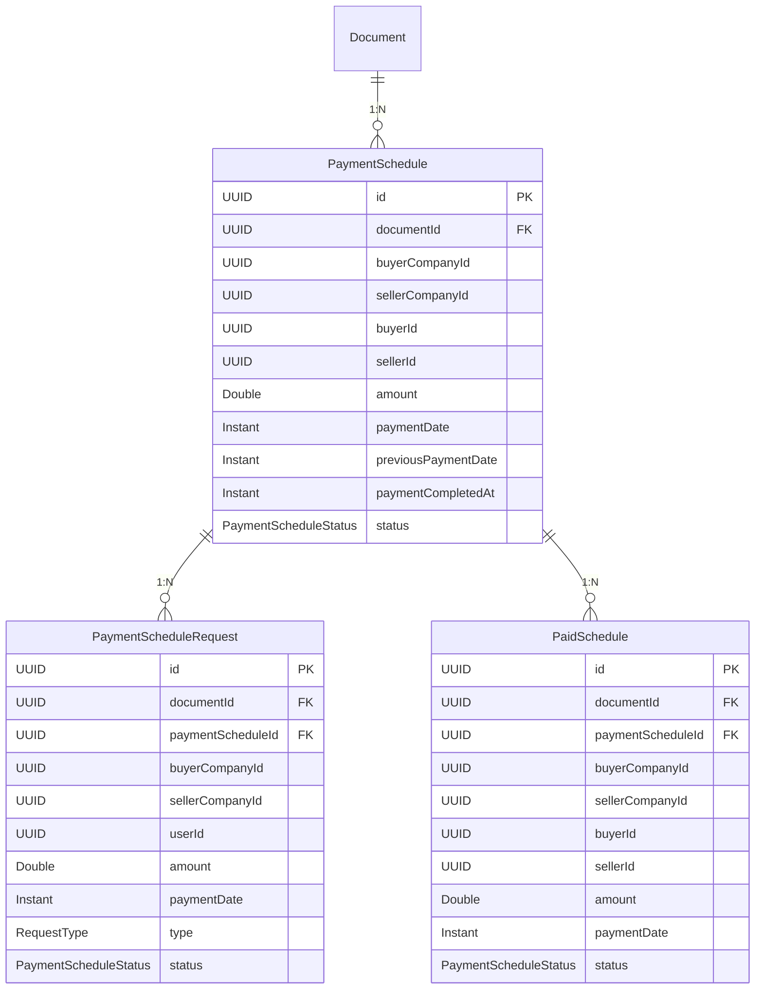

# Payment Flow — To'lov Tizimi

## Tuzilma

To'lov tizimi 3 ta asosiy entity dan iborat:

```
PaymentSchedule (jadval)
    │
    ├── PaymentScheduleRequest (so'rov, paymentScheduleId bilan bog'lanadi)
    │       │
    │       └── Tasdiqlanganda → PaidSchedule (amalga oshgan to'lov)
    │
    └── DelayRequest (kechiktirish so'rovi, type=DELAY)
```

## Entity tuzilishi



## Xavfsizlik: buyer/seller ID lar

**Muhim!** `buyerId`, `sellerId`, `buyerCompanyId`, `sellerCompanyId` request payloaddan emas,
`DocumentEntity` dan olinadi. Bu spoofing xujumlarini oldini oladi.

```java
// ✅ To'g'ri — documentdan
e.setBuyerCompanyId(doc.getBuyerCompanyId());
e.setBuyerId(doc.getBuyerUserId());

// ❌ Noto'g'ri — requestdan
e.setBuyerId(req.buyerId()); // XAVFLI — client har qanday ID yuborishi mumkin
```

## `withFullInfo` parametri (PaymentScheduleQueryService)

Barcha GET endpointlarda `?withFullInfo=false` (default) param bor:
- `false` → faqat entity ma'lumotlari (IDlar), user/company fetch qilinmaydi
- `true` → user service dan to'liq ma'lumot olinadi

```
GET /api/document/v1/{docId}/payment                    ← faqat IDlar
GET /api/document/v1/{docId}/payment?withFullInfo=true   ← to'liq info
```

## Authorization — B2B va C2C universal

C2C hujjatlarda `buyerCompanyId`/`sellerCompanyId` **null** bo'ladi.
Shuning uchun authorization 2 bosqichda tekshiriladi:

```java
// 1. B2B — companyId tekshirish
if (payment.getBuyerCompanyId() != null
    && userPrincipal.user().company() != null
    && payment.getBuyerCompanyId().equals(userPrincipal.user().company().id())) {
    isBuyer = true;
}
// 2. C2C — userId tekshirish (B2B topilmasa)
if (!isBuyer && payment.getBuyerId().equals(userPrincipal.user().id())) {
    isBuyer = true;
}
```

## Reactive zanjirda xatolik qaytarish

WebFlux da `throw` emas, `Mono.error()` ishlatish **SHART**:

```java
// ❌ XATO — reactive zanjir uziladi, GlobalExceptionHandler ishlamaydi
throw new InvalidOperationException("...");

// ✅ TO'G'RI — reactive pipeline da xatolik to'g'ri propagate bo'ladi
return Mono.error(new InvalidOperationException("..."));
```

## To'lov Hayot Sikli

```
1. Hujjat yaratiladi → PaymentSchedule lar yaratiladi (PENDING)
        │
2. Buyer → "Shuncha summani to'ladim" (paymentApprove)
        │
        ├── Buyer to'lov qildi:
        │   └── PaidSchedule (PENDING) yaratiladi → Seller tasdiqlashi kerak
        │
        └── Seller to'lov qildi:
            └── PaidSchedule (PAID) yaratiladi → to'g'ridan-to'g'ri PAID
        │
3. paidApprove — Seller approve/reject qiladi
        │
        ├── PAID → to'lov tasdiqlandi
        │         Agar jami = jadval summasi → schedule = PAID
        │
        └── CANCELLED → to'lov rad etildi
```

### Kechiktirish (Delay) Sikli

```
1. Buyer → delayPayment (yangi sana bilan)
        │
2. PaymentScheduleRequest (type=DELAY, PENDING) yaratiladi
        │
3. Seller → updateDelayPayment
        │
        ├── APPROVED:
        │   previousPaymentDate = eski sana (saqlanadi)
        │   paymentDate = yangi sana
        │
        └── CANCELLED:
            paymentDate o'zgarmaydi
```

## Notification qoidalari

| Harakat | Kim yuboradi | Kimga boradi |
|---------|-------------|--------------|
| paymentRequest yaratildi | buyer/seller | qarama-qarshi tomonga |
| paymentPaid (to'lov amalga oshdi) | buyer | seller |
| paidApproved | seller | buyer |
| paidRejected | seller | buyer |
| delayRequest yaratildi | buyer | seller |
| delayApproved | seller | buyer |
| delayRejected | seller | buyer |

> **Muhim:** Notification xatoligi asosiy flowni to'xtatmasin — `onErrorResume` bilan qamralgan.

## API Endpoints

### Payment Schedule
| Method | Endpoint | Vazifa |
|--------|----------|--------|
| GET | `/{docId}/payment` | Barcha to'lov jadvallari |
| GET | `/payment/{id}` | Bitta to'lov |
| POST | `/{docId}/payment` | Yaratish/yangilash (toggle) |
| DELETE | `/payment/{id}` | Soft-delete |

### Payment Request
| Method | Endpoint | Vazifa |
|--------|----------|--------|
| GET | `/{docId}/request` | Barcha so'rovlar |
| GET | `/request/{id}` | Bitta so'rov |
| GET | `/payment/{id}/requests` | Schedule bo'yicha so'rovlar |
| POST | `/{docId}/request` | So'rov yaratish |
| POST | `/request/approve` | Batch approve (eski) |
| POST | `/request/{id}/approve` | Bitta approve |
| POST | `/request/{id}/reject` | Rad etish |
| DELETE | `/request/{id}` | Soft-delete |

### Delay
| Method | Endpoint | Vazifa |
|--------|----------|--------|
| GET | `/payment/delay` | Delay so'rovlari |
| POST | `/payment/{id}/delay` | Buyer kechiktirish so'raydi |
| PATCH | `/payment/{id}/delay` | Seller javob beradi |

### Paid
| Method | Endpoint | Vazifa |
|--------|----------|--------|
| GET | `/{docId}/paid` | Barcha paid |
| GET | `/paid/{id}` | Bitta paid |
| GET | `/payment/{id}/paid` | Schedule bo'yicha paid |
| PUT | `/paid/{id}` | Seller approve/reject |
| POST | `/payment/pay` | To'lov amalga oshdi (eski) |

### Score
| Method | Endpoint | Vazifa |
|--------|----------|--------|
| GET | `/score/{userId}` | User to'lov reytingi |

## Service Tuzilmasi

```
PaymentScheduleController
    ├── PaymentScheduleQueryService   ← GET (withFullInfo param)
    │     ├── mapPaymentSchedules(withFullInfo)
    │     ├── mapPaymentRequests(withFullInfo)
    │     ├── mapPaidSchedules(withFullInfo)
    │     └── fetchMetadata()         ← batch user/company olish
    │
    ├── PaymentScheduleCommandService ← POST/PUT/DELETE (yangi flow)
    │     ├── togglePaymentSchedule()
    │     ├── createPaymentRequest()
    │     ├── approvePaymentRequest()
    │     ├── rejectPaymentRequest()
    │     ├── delayPayment()
    │     ├── updateDelayPayment()
    │     └── paidApprove()
    │
    └── PaymentScheduleService        ← eski backward-compat (approve, pay)
          ├── togglePaymentSchedule()
          ├── createPaymentRequest()
          ├── approvePaymentRequest()  ← batch approve (/request/approve)
          ├── paymentApprove()         ← /payment/pay
          ├── delayPayment()
          ├── updateDelayPayment()
          └── paidApprove()
```

## Tuzatilgan Buglar (v2)

1. `throw` → `Mono.error()` — reactive zanjirda to'g'ri ishlashi uchun
2. Notification noto'g'ri target — seller o'ziga notification olayotgan edi
3. `PaidSchedule.amount` — mapper payment summasini copy qilardi, actual summa emas
4. `findById` → `findByIdAndDeletedFalse` — deleted entity qaytmasligi uchun
5. Approve da status tekshiruvi — CANCELLED/APPROVED qayta approve bo'lardi
6. C2C NPE — `company()` null bo'lganda NPE chiqardi
7. `previousPaymentDate` — delay da eski sana saqlanmagan
8. `@Transactional` — `delayPayment` da yo'q edi
